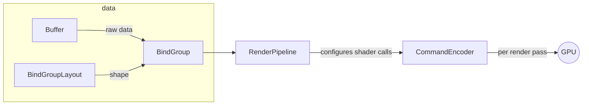

# <mark>\[DRAFT\]</mark> Retrospective

> TODOs remaining: 1

- [Personal Context](#personal-context)
- [Synthesis](#synthesis)
  - [JS13k first-timer lessons](#js13k-first-timer-lessons)
  - [3D Rotation Bestiary](#3d-rotation-bestiary)
  - [`mk_code_sml`](#mk_code_sml)
- [Regrets](#regrets)
  - [Regret #1](#1-taking-on-a-bit-more-than-my-current-body-could-handle)
  - [Regret #2](#2-not-writing-more-devtools-more-sooner)
  - [Regret #3](#3-deciding-against-an-event-driven-architecture)
  - [Honorable Mention](#honorable-mention-committing-to-limited-platform-support)
- [What's Next?](#whats-next)
  - [Director's Cut](#directors-cut)
  - [Community Contributions](#community-contributions)
- [In Closing](#in-closing)

### Personal Context

<details>

<summary>
I include this mainly as a <mark><b>"if you're like me, this will be maximally useful to
you"</b></mark> - it's relatively brief.
</summary>

- After obtaining a
  [particularly inscrutable degree in college](https://www.youtube.com/watch?v=2VYRjHPmZdQ)
  I got caught up in the "learn to code" movement and chose it as my preferred
  survival method (aka job). ~12 years of experience, now, depending how you
  count it.
- With a game design minor I'd focused mostly on board games until this. For a
  few years before COVID I co-ran a small
  [design workshop](https://metromage.games/2020/03/29/build-a-game-in-under-2-hours-no-really/).
- All LLM use was in accordance with my
  [current policy](https://github.com/cutout-studios/.github/blob/main/profile/LLM_USE.md),
  though I currently don't have a means of collecting logs so it's a bit of a
  "trust me, bro" situation. My next project is to finalize a
  [local harness](https://github.com/cutout-studios/toolbox/tree/main/experimental/agent)
  to solve that problem going forward.
- My goals with JS13K this year were simple: learn to build a 3D WebGPU game,
  make it as fun as I possibly can as concisely as possible and get to know the
  community a little bit.

</details>

## Synthesis

### JS13k first-timer lessons

1. I came into JS13K thinking "hell yeah, I can proceduralize whatever I want" -
   <mark><b>The one thing you <em>can't</em> proceduralize is explaining your
   game,</b></mark> and that's paramount here.

This makes successful innovation _particularly_ tricky in the JS13K format - per
[Jakob's Law](https://lawsofux.com/jakobs-law/):

> Users spend most of their time on other \[games\]. This means that users
> prefer your \[game\] to work the same way as all the other \[games\] they
> already know.

Anything novel incurs "explanation debt" - debt you cannot proceduralize away.

There are many and better ways of managing that debt without slamming down a
wall of text. For instance, studios like From Software can pay it down with the
decades of goodwill they've built up.

I'd now recommend the following exercise to a version of my past self that was
actually trying to "win": embrace
"[documentation driven development](https://gist.github.com/zsup/9434452)" here.
Write out the entire design of your game in **full detail** to the degree that
someone else can completely visualize your intent by reading it, and reserve
space for that text in your bundle until it's time to tutorialize. Leaving in
the buffer needed to clarify your game will ensure that you always can, and if
you need to cut something, you can cut it from the buffer as well. This time
around, I would have spent that budget on more depth cues, visual indicators and
maybe even a "shooting gallery" - things I had to drop at the very last minute.

Ultimately, I'm not even disappointed. "Winning"
[wasn't not the thing I was optimizing for](#personal-context), in part because
I knew being a first-timer there were some unmoored assumptions I'd invariably
make: like, "well, my codebase is turning out to be barely legible, so clearly
none of the games will be". No, they just had less scope.

2. At time of writing, the JS13K iframe allows only the following browser APIs:

<a name="allowlist"></a>

```
accelerometer
autoplay
camera
display-capture
fullscreen
gamepad
geolocation
gyroscope
magnetometer
microphone
midi
picture-in-picture
usb
web-share
xr-spatial-tracking
```

Meaning, I had to scramble to cut enough to replace a couple `alert()` calls I'd
used to save space at the last minute. I'd hesitated uploading an early draft to
the JS13K platform for fear of accidentally submitting, but now having used the
site I understand that wouldn't have been possible.

Do yourself a favor and develop your game _inside_ a frame that
[`allow`](https://developer.mozilla.org/en-US/docs/Web/API/HTMLIFrameElement/allow)s
the features that the JS13K platform is okay with.

3. <mark><b>You can push updates to your project description at any time
   throughout the review period.</b></mark> - Director's Cut is not your only
   recourse for catching issues - consider
   [syncing your description to feedback](https://github.com/js13kGames/mission-darkwhite/pull/3)
   as it comes in so each players' experience is better than the last!

4. Lastly, I'm a bit embarrassed to admit, but for some selfish reason I
   initially thought that once I'd finally submitted I was done. My exhaustion
   was partially to blame - but! <mark>_During_ the review period you
   _definitely_ need to _pay it forward_.</mark> The JS13K platform is
   specifically designed to push you to leave feedback on the games of those who
   have left feedback on yours, and that was not clear to me until I'd actually
   received my first feedback.

### 3D Rotation Bestiary

<!--
TODO: needs minor rework.
  - quaternion technically "folds" through 4d hypersphere, around lock
  - mention quat. interpolation
  - rodrigues/cave allegory is inaccurate (?)
-->

The most intimidating aspect of 3D programming that held me back for so many
years was rotations, and after all this, admittedly I still don't feel like I
fully understand them.

To get the player's ship to both roll and aim in the way that it currently does
I had to maintain a separate "roll" parameter, and I'm not entirely sure I get
why, but...

My sense is that it's akin to same deal that limits the most naïve rotation
approach: **Euler Angles**.

When you represent a rotation as three separate rotations around the X, Y, and Z
axes - each of these rotations removes a degree of freedom from the system.

This is because when you rotate your model around the X-axis, you inadvertently
rotate Y -into- Z, dampening that option for yourself. And again each time you
rotate that coordinate system.

This is why **Quaternions** exist - they effectively add an extra, "fake" fourth
degree-of-freedom-buffer that ensures you never run out. However, they are
impossible to visualize. The best I can picture in my mind is like, a shadow on
the wall in Plato's cave of the cube being rotated. This isn't really accurate
though.

_(problematic paragraph)_ ~~In fact, that visualization is more akin to the
**Rodrigues Matrix**, which, I learned, is basically necessary no matter what
rotation representation you expose to the developer. Rodrigues' rotation formula
works by
[decomposing the rotation down to its 2D elements](https://github.com/cutout-studios/js13k-2026/blob/main/libraries/3D/coordinates.ts#L24-L39) -
its "shadows". Quaternions are more performant, sure, but they really only shine
if you have hundreds of IKs to collapse, because they need to be
"Rodriguesified" before the final draw regardless.~~

Because of this, I've come to find <mark><b>the "axis-angle" representation the
more natural interface</mark></b>. In axis-angle, you define the XYZ components
of the rotation axis (like the earth's!) and then the angle of how much around
that axis you're rotating.

Come to think of it, each "Euler Angle" is an axis-angle rotation, one around
each of the X, Y and Z axes. Which means - while a single axis-angle rotation is
not at risk of lock like the three cumulative "Euler Angles" are, multiple
axis-angle rotations I believe still can be.

This comes back to the player ship. I had one axis-angle rotation for aiming,
another for the ship roll - but no more. Mostly safe.

This brings me to the final rotation representation I didn't really get to
explore: if you can compose multiple Quaternions with out risk of lock, is there
a similar such representation that conceptually follows from Axis-Angle? The
answer is yes - they're called **Rotors**.

[Rotors are sort of underrated in game development.](https://marctenbosch.com/quaternions/)
Like Axis-Angle, with a Rotor you're representing the 2D cross-section you're
rotating your object within (that the axis in your Axis-Angle is simply normal
to). The main difference is that a Rotor is stores its "axis" as three shadows
(called a "bivector") - the shadows that that cross-section would make were a
light to shine on it from each of the X, Y and Z directions.

Because Rotors are represented this way, they don't collapse. You combine them
by composing these "shadows". No risk of rotating one axis into another, and
better yet, they're just as cheap as Quaternions computationally and interpolate
fine.

So why don't we use Rotors everywhere? Unclear. I think Quaternions just got
there first.

### `mk_code_sml`

There are multiple aspects to making your code small, and JS13K forces you to be
intimately familiar with them all. There's no silver bullet. You have to attack
the size of your game from every direction:

#### Build Pipeline

Your build pipeline is what compacts your written code down and is really half
the JS13K battle. The first thing I did was [set one up](./scripts/bundle.ts).
There are three key components to code compaction:

- **Minification** - strips all human-relevant information from the code.
  Human-facing methods and data get renamed from what you called them (think
  `myCoolFunction`) to the nearest-available, shortest identifier (like `a`,
  `b`, `c`, and so on)
  - Because JavaScript is compiled "just in time" (i.e. as it runs),
    minification has this interesting side effect of improving your initial
    execution time slightly (as there's less input to scan during that process)
  - Also, because minification is "intent preserving", a separate minifier is
    required for each language in your program. I used:
    - [`Deno.bundle`](https://docs.deno.com/runtime/reference/cli/bundle/) for
      TypeScript.
    - [`html-minifier-next`](https://github.com/j9t/html-minifier-next) for HTML
      and CSS.
    - [`esbuild-minify-templates`](https://github.com/MaxMilton/esbuild-minify-templates)
      for raw text 🤷
    - [`wgsl-plus`](https://github.com/JSideris/wgsl-plus) for the shader, but
      it isn't complete. I've just learned about
      [`wgslender`](https://github.com/HugoDaniel/wgslender) which may have
      saved me some work.
  - I recommend printing your minified code to the terminal every build - you'll
    notice things that could be made more mini. This tactic helped me catch
    object properties that were preserved, leading to an overhaul which
    converted everything into tuples, functions, inlined values and system
    aliases (I'd had property mangling at one point but dropped it). This alone
    saved me a minimum of 500 bytes (the equivalent ~2-3 small features).
- [**Roadroller**](https://github.com/lifthrasiir/roadroller) - Patron saint of
  JS13K, this utility does a random walk over the text you feed it and
  procedurally comes up with a bitpacking solution for that text. That text is
  then injected into your app shell via your specified method.
  - I would recommend the "write" method over "eval" (s/o
    [@scmx](https://github.com/scmx) for the advice!!). Roadroller hasn't been
    updated in years and chokes on modern JavaScript when you use "eval".
  - As it is random, you'll want to run Roadroller multiple times in your
    pipeline and
    [take the best result](https://github.com/cutout-studios/js13k-2026/blob/main/scripts/bundle.ts#L133-L156).
    The terminal interface can
    [do this automatically](https://github.com/lifthrasiir/roadroller#output-configuration)
    if you decide you just wanna run shell commands.
- **Compression** - similar to Roadroller, looks for patterns across the entire
  input it can fold together at a <mark><b>binary</b></mark> level.
  - Unlike minification, compression is "destructive" in that a compressed
    payload needs to be "uncompressed" to be run again.
  - Unlike Roadroller, most compression algorithms operate on the raw binary,
    not the text level that we can actually read. They're also deterministic.

So, are all of these steps _actually_ necessary? Yes!

| Minified? | Road Roller'd? | Compressed w/ ECT? | Size   | Timing* | Compaction |
| --------- | -------------- | ------------------ | ------ | ------- | ---------- |
| ✅        | ✅             | ✅                 | 13294  | <2m     | 87.1%      |
| ✅        | ❌             | ✅                 | 14655  | <100ms  | 85.8%      |
| ✅        | ✅             | ❌                 | 17572  | <2m     | 83%        |
| ❌        | ✅             | ✅                 | 20347  | >5m     | 80.3%      |
| ❌        | ❌             | ✅                 | 23528  | ~150ms  | 77.2%      |
| ❌        | ✅             | ❌                 | 26915  | >5m     | 73.9%      |
| ✅        | ❌             | ❌                 | 32826  | <50ms   | 68.2%      |
| ❌        | ❌             | ❌                 | 103136 | <50ms   | 0%         |

<figcaption>*All tests run with `deno run bundle` once or twice on M5 Max Apple Silicon.</figcaption>

As you can see each component meaningfully brings the total size of the game
down.

Now, for JS13K, only the DEFLATE family of compression algorithms are legal, but
I couldn't help but see how [Brotli](https://en.wikipedia.org/wiki/Brotli) would
have fared. The following results are all compressed with Brotli:

| Minified? | Road Roller'd? | Size      | Timing* | Compaction |
| --------- | -------------- | --------- | ------- | ---------- |
| ✅        | ✅             | **13178** | <2m     | **87.2%**  |
| ✅        | ❌             | 13599     | <100ms  | 86.8%      |
| ❌        | ✅             | 20231     | >5m     | 80.4%      |
| ❌        | ❌             | 21225     | ~100ms  | 79.4%      |

Some interesting tradeoffs, here:

- Brotli w/o Roadroller is only 2% bigger than the submitted game, but
  _meaningfully_ faster to build (milliseconds vs. minutes)!
- Roadroller on _top_ of Brotli saves _even more_ bytes! Crying knowing I could
  have had another precious 134B to work with. If only!

This points to an interesting technical takeaway: while unsafe for user-provided
content, Roadroller is fine for a small "app kernel" if you run it once and
cache the result. Dunno why I've never seen in it production. I'll be saving
that one for later!

#### Architecture

Obviously how you structure your project matters immensely. I'd say the biggest
wins for me fell into three main categories:

- **Browser APIs**

Use them. It's free real estate.
[Only the ones that are allowed, though.](#allowlist), though the
[WebAudio API](https://developer.mozilla.org/en-US/docs/Web/API/Web_Audio_API)
is basically required.

Example: instead of building a new shader to generate the "galaxy" effect, I
just used an animated CSS gradient. Far more compact than the alternative.

Speaking of Browser APIs, WebGPU isn't actually that bad! The API is actually
kinda "flat" - very configuration-heavy - which is a good thing ultimately.

All that configuration is doing is allowing you to customize how exactly the
data you're transferring to the GPU should be passed into your GPU code
(shaders). `Buffer`s, `BindGroup`s and `BindGroupLayout`s are the means by which
you structure and load the raw data, and then your `RenderPipeline` configures
how that loaded data is split up across the shader calls. The actual _rendering_
is done by the `CommandEncoder` part of the API, which is where everything comes
together on a per-render pass basis (meaning, you can switch between different
`RenderPipeline` configurations as needed).



Everything else provided is basically just... different options for how to do
all that. Once I'd developed this basic mental model for working with WebGPU, it
became a lot less intimidating.

If you want to learn WebGPU, I started with
[webgpufundamentals.org](https://webgpufundamentals.org), but eventually
switched to picking apart
[the examples here](https://webgpu.github.io/webgpu-samples/) line by line,
which I found to be a lot more helpful.

- **Proceduralization**

Proceduralization basically makes the JS13K world go around. If anything, it
will force you to work these muscles. My biggest wins were procedural - the
diversity of geometry I had exploded when I realized I could generate everything
as a [lathe](https://en.wikipedia.org/wiki/Lathe) does:

```ts
const lathe = (loops, divisions) => {
  const result = [];

  for (const [radius, position] of loops) {
    for (let index = 0; index < divisions; index++) {
      result.push(
        getLatheTriangle(radius, divisions, index, position),
      );
    }
  }

  return result;
};
```

<figcaption><a href="./libraries/3D/geometry.ts">(Actual implementation here.)</a></figcaption>

Randomness is the most basic form of proceduralization. The simple methods
written to
[pick a value randomly from a range](https://github.com/cutout-studios/js13k-2026/blob/main/libraries/random.ts#L6-L8)
or to
[ensure no repeats](https://github.com/cutout-studios/js13k-2026/blob/main/app/game/decks.ts#L26-L34)
ended up getting used a surprising amount.

- **Dirty Abstractions**

This was a trick that came to me during the competition - since compressors love
repetition, what if I were to _force_ abstractions I normally wouldn't? A couple
examples:

- In place of pretty much every loop I could I wrote
  [`doTimes`](https://github.com/cutout-studios/js13k-2026/blob/main/libraries/common.ts#L30-L38).
  Felt gross. Saved me hundreds of bytes.
- Despite the player ship being objectively a different thing than the enemy
  ships, I forced both the player and the enemies to use the same ship code. It
  sucked. +100 bytes.
- This also didn't always work.
  [`flat`](https://github.com/cutout-studios/js13k-2026/blob/main/libraries/common.ts#L39-L63)
  ended up being net neutral, but migrating to it was so much work I just left
  it in in the hopes that it might amoritize.

It's weird. As with everything in JS13K, I'd like to say you should only reach
for this technique if you're desperate. But... you _will_ be desperate.

## Regrets

### 1. **Taking on a bit more than my current body could handle.**

I've been a full-time informal caretaker for a couple years now and didn't quite
realize how much my own health had slipped. My ambitious nature has been
tempered by age, but my barometer was off. I initially thought "oh surely I'll
run out of space in the first couple weeks" - I ended up working right up to the
deadline, and I probably could have kept scraping against the byte limit for
another few days.

I still managed to complete ~90% of what I'd initially planned (with the
remaining 10% still being fairly important), but don't be fooled -
<mark><b>Despite the month-long window, JS13k is just as much about energy and
time management as it is byte management.</b></mark>

### 2. **Not writing more devtools more sooner.**

I admittedly over-focused on the things that were relatively new to me - the 3D
programming and the golfing.

It is difficult, though, to justify tests or tools for things you're not even
sure you can fit. This led to a lot of "running ahead" with imperfect logic to
get a rough idea of how much code it would be or compress to. <mark><b>I also
found that one line of sketch code ultimately averaged to ~5 bytes in the
bundle,</b></mark> but YMMV (the final ratio was 1 line:3 bytes).

I also didn't realize how painful debugging that same "sketch logic" would be.
Logging from the game loop crashes Safari, and debugging is too tedious. Do we
really need a separate widget to confirm our games work? A previous boss of mine
[worked with internet standards bodies](https://datatracker.ietf.org/doc/rfc9460/) -
unless I'm missing something, it's so bad I am in fact planning on
[proposing a `console.log` extension](#community-contributions) of my own.

Overall JS13K kinda forces you to choose small software over your own developer
experience and I <mark><b>got stuck a bit too long in the mindset that I
couldn't have ANYTHING nice</b></mark>, to my detriment.

When I did break that mentality, the lion's share of my total LLM use was in
service of [spitting out crappy devtools](./devtools/) to make it easier to work
with my custom formats in the final days. At time of writing they're decent at
that, pretty much everything else was hit or miss.

### 3. **Deciding against an event-driven architecture.**

This is minor, but I initially ruled out an
[event-driven architecture](https://en.wikipedia.org/wiki/Event-driven_architecture)
for fear that it would be too heavy. But, as I slowly eroded the quality of my
codebase to shave bytes, I began to realize that such a structure would have
likely been more resistant to tangling,
[easier to debug](https://github.com/whatwg/console/issues/255), and similar in
terms of byteweight. I'd recommend this to anyone attempting JS13K now.

That said, in my own work I will likely continue to
[lean heavily on a core loop](https://github.com/cutout-studios/toolbox/tree/main/jsx),
so I at least gave myself a preview of that.

### Honorable Mention: **Committing to limited platform support.**

I'm flagging this not necessarily as a regret but more so a conscious choice I
would not have taken had my goal been to "go for the win" (where maximizing
accessibility is much more important).

Committing to WebGPU and a 2-button mouse meant that fewer people could play the
game as intended - but I was determined to see the best core I could make.

This tradeoff has already been reflected in initial reviews, and while yes, it
is mildly frustrating, I successfully proved to myself what's possible.

## What's Next?

### Director's Cut

I've thought a lot about this, and I'll do a Director's Cut only if MISSION
DARKWHITE somehow becomes noteworthy (so, no). The codebase is a (necessary)
mess and I would have to mostly rewrite it before proceeding.

Don't get me wrong, I like this game and wouldn't mind developing it further,
but currently have other priorities.

For posterity though, here's the priority list of what I'd change in rough
[impact/effort](https://www.projectmanager.com/blog/impact-effort-matrix/)
order:

#### Minor Correctness Improvements

- Restore the "continuous" mode I accidentally cut in the final moments when
  replacing the `alert()` calls.
- Restructure the graphics pipeline to properly handle transparency and
  instancing. This means breaking up instance groups by size, depth, and
  material data.

#### Accessibility

- Add in the visual cues that were top of the list of things I cut:
  - Visual indicator for when the player took damage. Could have simply reused
    the enemy code, in hindsight.
  - Highlighting dropped items. I'd wanted to have items pause and float in the
    player's plane for a moment, little arrows pointing to them based on the
    rank of the item (e.g. rank 2 = 2 arrows).
  - Bullet "glow" and illumination/shadow to make it extremely clear where in
    the world those bullets were relative to the enemies, with additional
    landmarks to boot.
- Map the WASD controls to a virtualized stick. This should make the ship
  steering even smoother and allow for controller support.
- Some sort of lock-on or auto-aim mechanism. This would make way for supporting
  coarser control setups, like trackpads or maybe mobile.

#### Graphics

- Additional particle effects: ship thrusters, explosions.
- A bit of narrative color: I'd envisioned this sector of space to take place in
  a vast crystalline structure. I'd love to enhance the background to this
  effect.
- Glow effects. Not only nice to look at, would help distinguish various
  entities from one another further.

#### Content

- I've actually been
  [writing music for ages](https://soundcloud.com/daniellacosse/piano-deconstruction)
  and was bummed I couldn't fit anything.
- ∞

### Community Contributions

Given the difficulties I encountered in developing MISSION DARKWHITE, I have
begun thinking about how to improve ecosystem as a whole.

1. Something that irked me - there's no real good way to debug your game loop
   without writing something custom. Given the roll out of WebGPU, one would
   hope that the standards community is taking the game development use case
   more seriously. And maybe they are, but just... slowly.

   It's small, but I'm
   [proposing an improvement](https://github.com/whatwg/console/issues/255) to
   the [WHATWG console](https://whatwg.org/stages#process) that should make
   debugging _slightly_ better, `%t`:

```js
console.log("%tFailed to load map asset: %s", "Network Error", assetId);
// => [[Network Error]] Failed to load map asset: 123
```

Logs are expensive in the browser due to the IPC and UI calls they make, so
having a hook to short-circuit them by topic would ameliorate - but not
completely solve - the issue. Run this in your inspector to see for yourself:

```ts
(() => {
  const stringformattingstuff = (i) =>
    `Entity #${i}: x=${(Math.random() * 100).toFixed(2)}, y=${
      (Math.random() * 100).toFixed(2)
    }`;
  const thing = {};

  let now = performance.now();
  for (let i = 0; i < 1000; i++) {
    thing.ref = `[Telemetry] ${stringformattingstuff(i)}`;
  }
  const formattingTime = performance.now() - now;

  now = performance.now();
  for (let i = 0; i < 1000; i++) {
    console.log(`[Telemetry] ${stringformattingstuff(i)}`);
  }
  const logTime = performance.now() - now;

  console.clear();
  console.log({ formattingTime, logTime });
  // => formattingTime: ~<1ms, logTime: 10-20ms
  console.log(thing.ref);
})();
```

This solution is related in part to the
[2021 `console.context()` proposal](https://github.com/MicrosoftEdge/MSEdgeExplainers/blob/main/ContextualLoggingWithConsoleContext/explainer.md),
which died mainly because it added too much complexity to existing systems; `%t`
shouldn't.

Regardless, it's a small gesture. I plan to get in touch with my old boss to see
if he can't help me strategize further.

2. I found out that
   [`Deno.bundle`](https://docs.deno.com/runtime/reference/cli/bundle/) doesn't
   actually expose
   [property mangling](https://github.com/evanw/esbuild/issues/218), and I can
   find no record of it being attempted, so I'll be working on a (hopefully)
   small PR to expose that feature from esbuild.

## In Closing

If you made it to the end, thank you very much for reading and I hope you
learned something!

You should certainly at least try
[`MISSION: DARKWHITE`](https://js13kgames.com/games/mission-darkwhite) if you
haven't already.

If you'd like to support future endeavors, I encourage you do any of the
following:

1. [Follow on Bluesky](https://bsky.app/profile/cutoutstudios.com), though I'm
   unclear what form this social media approach will ultimately take. Just
   starting out here.
2. [Apply to join our small Discord!](https://discord.gg/DW5pyrjsYm) It's easy,
   just a bot-prevention measure. Would love to have you - we have weekly
   progress check-ins.
3. [Sponsoring the GitHub](https://github.com/sponsors/cutout-studios) would
   genuinely help me
   [qualify for food stamps](https://www.fna.usda.gov/snap/work-requirements) so
   I can keep doing these sorts of things 😭

Thanks again, and until next time! ✌️

- Daniel
