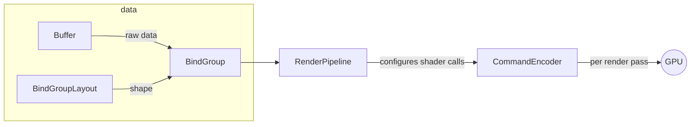

<!-- TODO: label + fudge -->

### `mk_code_sml`

There are multiple aspects to making your code small, and JS13K forces you to be
intimately familiar with them all. There's no silver bullet. You have to attack
the size of your game from every direction:

#### Build Pipeline

Your build pipeline is what compacts your written code down and is really half
the JS13K battle. The first thing I did was [set one up](./scripts/bundle.ts).
There are three key components to code compaction:

- **Minification** - strips all human-relevant information from the code.
  Human-facing methods and data get renamed from what you called them (think
  `myCoolFunction`) to the nearest-available, shortest identifier (like `a`,
  `b`, `c`, and so on)
  - Because JavaScript is compiled "just in time" (i.e. as it runs),
    minification has this interesting side effect of improving your initial
    execution time slightly (as there's less input to scan during that process)
  - Also, because minification is "intent preserving", a separate minifier is
    required for each language in your program. I used:
    - [`Deno.bundle`](https://docs.deno.com/runtime/reference/cli/bundle/) for
      TypeScript.
    - [`html-minifier-next`](https://github.com/j9t/html-minifier-next) for HTML
      and CSS.
    - [`esbuild-minify-templates`](https://github.com/MaxMilton/esbuild-minify-templates)
      for raw text 🤷
    - [`wgsl-plus`](https://github.com/JSideris/wgsl-plus) for the shader, but
      it isn't complete. I've just learned about
      [`wgslender`](https://github.com/HugoDaniel/wgslender) which may have
      saved me some work.
  - I recommend printing your minified code to the terminal every build - you'll
    notice things that could be made more mini. This tactic helped me catch
    object properties that were preserved, leading to an overhaul which
    converted everything into tuples, functions, inlined values and system
    aliases (I'd had property mangling at one point but dropped it). This alone
    saved me a minimum of 500 bytes (the equivalent ~2-3 small features).
- [**Roadroller**](https://github.com/lifthrasiir/roadroller) - Patron saint of
  JS13K, this utility does a random walk over the text you feed it and
  procedurally comes up with a bitpacking solution for that text. That text is
  then injected into your app shell via your specified method.
  - I would recommend the "write" method over "eval" (s/o
    [@scmx](https://github.com/scmx) for the advice!!). Roadroller hasn't been
    updated in years and chokes on modern JavaScript when you use "eval".
  - As it is random, you'll want to run Roadroller multiple times in your
    pipeline and
    [take the best result](https://github.com/cutout-studios/js13k-2026/blob/main/scripts/bundle.ts#L133-L156).
    The terminal interface can
    [do this automatically](https://github.com/lifthrasiir/roadroller#output-configuration)
    if you decide you just wanna run shell commands.
- **Compression** - similar to Roadroller, looks for patterns across the entire
  input it can fold together at a <mark><b>binary</b></mark> level.
  - Unlike minification, compression is "destructive" in that a compressed
    payload needs to be "uncompressed" to be run again.
  - Unlike Roadroller, most compression algorithms operate on the raw binary,
    not the text level that we can actually read. They're also deterministic.

So, are all of these steps _actually_ necessary? Yes!

| Minified? | Road Roller'd? | Compressed w/ ECT? | Size   | Timing* | Compaction |
| --------- | -------------- | ------------------ | ------ | ------- | ---------- |
| ✅        | ✅             | ✅                 | 13294  | <2m     | 87.1%      |
| ✅        | ❌             | ✅                 | 14655  | <100ms  | 85.8%      |
| ✅        | ✅             | ❌                 | 17572  | <2m     | 83%        |
| ❌        | ✅             | ✅                 | 20347  | >5m     | 80.3%      |
| ❌        | ❌             | ✅                 | 23528  | ~150ms  | 77.2%      |
| ❌        | ✅             | ❌                 | 26915  | >5m     | 73.9%      |
| ✅        | ❌             | ❌                 | 32826  | <50ms   | 68.2%      |
| ❌        | ❌             | ❌                 | 103136 | <50ms   | 0%         |

<figcaption>*All tests run with `deno run bundle` once or twice on M5 Max Apple Silicon.</figcaption>

As you can see each component meaningfully brings the total size of the game
down.

Now, for JS13K, only the DEFLATE family of compression algorithms are legal, but
I couldn't help but see how [Brotli](https://en.wikipedia.org/wiki/Brotli) would
have fared. The following results are all compressed with Brotli:

| Minified? | Road Roller'd? | Size      | Timing* | Compaction |
| --------- | -------------- | --------- | ------- | ---------- |
| ✅        | ✅             | **13178** | <2m     | **87.2%**  |
| ✅        | ❌             | 13599     | <100ms  | 86.8%      |
| ❌        | ✅             | 20231     | >5m     | 80.4%      |
| ❌        | ❌             | 21225     | ~100ms  | 79.4%      |

Some interesting tradeoffs, here:

- Brotli w/o Roadroller is only 2% bigger than the submitted game, but
  _meaningfully_ faster to build (milliseconds vs. minutes)!
- Roadroller on _top_ of Brotli saves _even more_ bytes! Crying knowing I could
  have had another precious 134B to work with. If only!

This points to an interesting technical takeaway: while unsafe for user-provided
content, Roadroller is fine for a small "app kernel" if you run it once and
cache the result. Dunno why I've never seen in it production. I'll be saving
that one for later!

#### Architecture

Obviously how you structure your project matters immensely. I'd say the biggest
wins for me fell into three main categories:

- **Browser APIs**

Use them. It's free real estate.
[Only the ones that are allowed, though.](#allowlist), though the
[WebAudio API](https://developer.mozilla.org/en-US/docs/Web/API/Web_Audio_API)
is basically required.

Example: instead of building a new shader to generate the "galaxy" effect, I
just used an animated CSS gradient. Far more compact than the alternative.

Speaking of Browser APIs, WebGPU isn't actually that bad! The API is actually
kinda "flat" - very configuration-heavy - which is a good thing ultimately.

All that configuration is doing is allowing you to customize how exactly the
data you're transferring to the GPU should be passed into your GPU code
(shaders). `Buffer`s, `BindGroup`s and `BindGroupLayout`s are the means by which
you structure and load the raw data, and then your `RenderPipeline` configures
how that loaded data is split up across the shader calls. The actual _rendering_
is done by the `CommandEncoder` part of the API, which is where everything comes
together on a per-render pass basis (meaning, you can switch between different
`RenderPipeline` configurations as needed).



Everything else provided is basically just... different options for how to do
all that. Once I'd developed this basic mental model for working with WebGPU, it
became a lot less intimidating.

If you want to learn WebGPU, I started with
[webgpufundamentals.org](https://webgpufundamentals.org), but eventually
switched to picking apart
[the examples here](https://webgpu.github.io/webgpu-samples/) line by line,
which I found to be a lot more helpful.

- **Proceduralization**

Proceduralization basically makes the JS13K world go around. If anything, it
will force you to work these muscles. My biggest wins were procedural - the
diversity of geometry I had exploded when I realized I could generate everything
as a [lathe](https://en.wikipedia.org/wiki/Lathe) does:

```ts
const lathe = (loops, divisions) => {
  const result = [];

  for (const [radius, position] of loops) {
    for (let index = 0; index < divisions; index++) {
      result.push(
        getLatheTriangle(radius, divisions, index, position),
      );
    }
  }

  return result;
};
```

<figcaption><a href="./libraries/3D/geometry.ts">(Actual implementation here.)</a></figcaption>

Randomness is the most basic form of proceduralization. The simple methods
written to
[pick a value randomly from a range](https://github.com/cutout-studios/js13k-2026/blob/main/libraries/random.ts#L6-L8)
or to
[ensure no repeats](https://github.com/cutout-studios/js13k-2026/blob/main/app/game/decks.ts#L26-L34)
ended up getting used a surprising amount.

- **Dirty Abstractions**

This was a trick that came to me during the competition - since compressors love
repetition, what if I were to _force_ abstractions I normally wouldn't? A couple
examples:

- In place of pretty much every loop I could I wrote
  [`doTimes`](https://github.com/cutout-studios/js13k-2026/blob/main/libraries/common.ts#L30-L38).
  Felt gross. Saved me hundreds of bytes.
- Despite the player ship being objectively a different thing than the enemy
  ships, I forced both the player and the enemies to use the same ship code. It
  sucked. +100 bytes.
- This also didn't always work.
  [`flat`](https://github.com/cutout-studios/js13k-2026/blob/main/libraries/common.ts#L39-L63)
  ended up being net neutral, but migrating to it was so much work I just left
  it in in the hopes that it might amoritize.

It's weird. As with everything in JS13K, I'd like to say you should only reach
for this 

### 3D Rotation Bestiary

The most intimidating aspect of 3D programming that held me back for so many
years was rotations, and after all this, admittedly I still don't feel like I
fully understand them.

To get the player's ship to both roll and aim in the way that it currently does
I had to maintain a separate "roll" parameter, and I'm not entirely sure I get
why, but...

My sense is that it's akin to same deal that limits the most naïve rotation
approach: **Euler Angles**.

When you represent a rotation as three separate rotations around the X, Y, and Z
axes - each of these rotations removes a degree of freedom from the system.

This is because when you rotate your model around the X-axis, you inadvertently
rotate Y -into- Z, dampening that option for yourself. And again each time you
rotate that coordinate system.

This is why **Quaternions** exist - they effectively add an extra, "fake" fourth
degree-of-freedom-buffer that ensures you never run out (it's not fake exactly,
technically you're using that fourth dimension as a means to "fold around" the
lock). They are impossible to visualize. The best I can picture in my mind is
like, a shadow on the wall in Plato's cave of the cube being rotated, which
isn't even right.

Because of this, I've come to find <mark><b>the "axis-angle" representation the
more natural interface</mark></b>. In axis-angle, you define the XYZ components
of the rotation axis (like the earth's!) and then the angle of how much around
that axis you're rotating.

Come to think of it, each "Euler Angle" is an axis-angle rotation, one around
each of the X, Y and Z axes. Which means - while a single axis-angle rotation is
not at risk of lock like the three cumulative "Euler Angles" are, multiple
axis-angle rotations I believe still can be.

This comes back to the player ship. I had one axis-angle rotation for aiming,
another for the ship roll - but no more. Mostly safe.

This brings me to the final rotation representation I didn't really get to
explore: if you can compose multiple Quaternions with out risk of lock, is there
a similar such representation that conceptually follows from Axis-Angle? The
answer is yes - they're called **Rotors**.

[Rotors are sort of underrated in game development.](https://marctenbosch.com/quaternions/)
Like Axis-Angle, with a Rotor you're representing the 2D cross-section you're
rotating your object within (that the axis in your Axis-Angle is simply normal
to). The main difference is that a Rotor is stores its "axis" as three shadows
(called a "bivector") - the shadows that that cross-section would make were a
light to shine on it from each of the X, Y and Z directions.

Because Rotors are represented this way, they don't collapse. You combine them
by composing these "shadows". No risk of rotating one axis into another, and
better yet, they're just as computationally cheap as Quaternions and also
interpolate fine.

So why don't we use Rotors everywhere? Unclear. I think Quaternions just got
there first.
