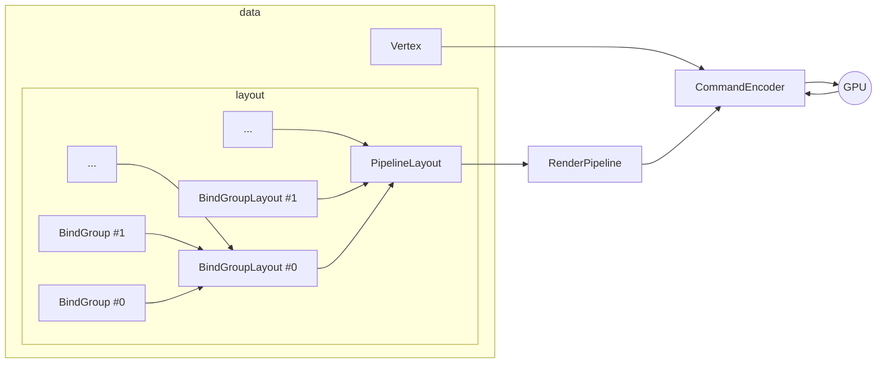

# <mark>\[WIP\]</mark> Technical Appendix

> WIP: finish WebGPU section

JS13K forces you to get intimately familiar with every way to make code small -
there's no silver bullet, you have to attack size from every direction. Here's a
walkthrough of how DARKWHITE got to 13KB.

## Build Pipeline

Your build pipeline compacts what you've written and is half the battle; the
first thing I did was
[set one up](https://github.com/cutout-studios/js13k-2026/blob/main/scripts/bundle.ts).
Three components do the compacting:

### Minification

Minification strips human-relevant information from the code: methods and data
get renamed from what you called them (`myCoolFunction`) to the
nearest-available, shortest identifier (`a`, `b`, `c`, and so on). Because
JavaScript compiles "just in time," minification can have side effect of
increasing your initial execution time slightly.

Minification is "intent preserving," so the process needs to understand the
language you're compacting. I used
[`Deno.bundle`](https://docs.deno.com/runtime/reference/cli/bundle/) for
TypeScript, [`html-minifier-next`](https://github.com/j9t/html-minifier-next)
for HTML and CSS,
[`esbuild-minify-templates`](https://github.com/MaxMilton/esbuild-minify-templates)
for raw text, and [`wgsl-plus`](https://github.com/JSideris/wgsl-plus) for the
shader - it isn't complete, and
[`wgslender`](https://github.com/HugoDaniel/wgslender) might have saved me some
work.

**Tip:** Read your minified code - you'll spot things that could be even
smaller. I caught code that was then compacted into tuples, functions, inlined
values, and system aliases - a roughly 500-byte savings, equivalent to a couple
small features.

### [Roadroller](https://github.com/lifthrasiir/roadroller)

Patron saint of JS13K, Roadroller does a random walk over the text you feed it
and procedurally finds a bitpacking solution. It injects that result into an app
shell via your chosen method. **Tips:**

- Prefer the "write" method over "eval" (s/o [@scmx](https://github.com/scmx)
  for the advice!!) - Roadroller hasn't been updated in years and chokes on
  modern JavaScript under "eval".
- It's random, so run it multiple times and
  [keep the best result](https://github.com/cutout-studios/js13k-2026/blob/main/scripts/bundle.ts#L133-L156).
  The CLI can
  [do this automatically](https://github.com/lifthrasiir/roadroller#output-configuration).

### Compression

Like Roadroller, finds patterns across the entire input, but folds them together
at a <mark><b>binary</b></mark> level instead of a text one. Unlike the above
methods, the result needs to be uncompressed before it can be run again.

### Putting it Together

| Minified? | Road Roller'd? | Compressed w/ ECT? | Size   | Timing* | Compaction |
| --------- | -------------- | ------------------ | ------ | ------- | ---------- |
| ✅        | ✅             | ✅                 | 13294  | <2m     | 87.1%      |
| ✅        | ❌             | ✅                 | 14655  | <100ms  | 85.8%      |
| ✅        | ✅             | ❌                 | 17572  | <2m     | 83%        |
| ❌        | ✅             | ✅                 | 20347  | >5m     | 80.3%      |
| ❌        | ❌             | ✅                 | 23528  | ~150ms  | 77.2%      |
| ❌        | ✅             | ❌                 | 26915  | >5m     | 73.9%      |
| ✅        | ❌             | ❌                 | 32826  | <50ms   | 68.2%      |
| ❌        | ❌             | ❌                 | 103136 | <50ms   | 0%         |

_*All tests run with `deno run bundle` once or twice on M5 Max Apple Silicon._

JS13K only allows the DEFLATE family of compression algorithms, but I couldn't
help but try [Brotli](https://en.wikipedia.org/wiki/Brotli):

| Minified? | Road Roller'd? | Size      | Timing* | Compaction |
| --------- | -------------- | --------- | ------- | ---------- |
| ✅        | ✅             | **13178** | <2m     | **87.2%**  |
| ✅        | ❌             | 13599     | <100ms  | 86.8%      |
| ❌        | ✅             | 20231     | >5m     | 80.4%      |
| ❌        | ❌             | 21225     | ~100ms  | 79.4%      |

Some tradeoffs:

- Brotli without Roadroller is only 2% bigger than the submitted game, but
  _meaningfully_ faster to build (milliseconds vs. minutes)!
- Roadroller on _top_ of Brotli saves _even more_ bytes! Crying that I coulda
  had another precious 134B to work with. If only!

**Roadroller in production?** Roadroller's "write" method decodes via
`document.write`: a non-starter for user-provided content. But if run against
your core logic I don't see why you can't ship the cached the result. Seems like
a potential win if the unpacking overhead is small!

## Browser APIs

An big part of keeping your entry small is leaning on Browser APIs wherever
possible. There were two in my entry: `WebAudio` (very common) and `WebGPU`
(brand new this year!).

### `WebGPU`

WebGPU has been around for a while but this year was the first year it was valid
for JS13K _because_ it has finally been turned on by default in both Chrome and
Firefox. The API _sounds_ intimidating but after some time with it, I didn't
find it too bad.

The API is very, how do you say, "flat": configuration-heavy. Declarative. Generally speaking, all the configuration does is let you
customize how your data ends up in your shader code. 

Specifically, `Layout`s allow you to organize the sent data across one or more `BindGroups`; your `RenderPipeline` configures how that data gets sent to which
shader calls; the `CommandEncoder` executes the actual process.


```mermaid
flowchart LR
  subgraph data
    subgraph layout
      BG3[...] --> BGL1
      BG2[BindGroup #1] --> BGL1
      BG1[BindGroup #0] --> BGL1
      BGL3[...] --> PipelineLayout
      BGL2[BindGroupLayout #1] --> PipelineLayout
      BGL1[BindGroupLayout #0] --> PipelineLayout
    end
    Vertex
  end
  Vertex --> CommandEncoder
  PipelineLayout --> RenderPipeline
  RenderPipeline --> CommandEncoder
  CommandEncoder --> GPU((GPU))
  GPU --> CommandEncoder
```

Everything WebGPU provides is basically just different options for how to
do all that. Once I had settled on this mental model, the API became a lot less intimidating.

### Managing Render Data: `Vertex` vs. `PipelineLayout`

TODO

<!-- Here's what that looks like in practice. Every object in the game shares one
[pipeline layout](https://github.com/cutout-studios/js13k-2026/blob/main/libraries/3D/webgpu/setupDevice.ts)
with exactly two bind group layouts - one storage buffer for per-instance
coordinates, one for per-material color data - so there's really only a handful
of actual `GPURenderPipeline`s in the whole game,
[cached per material](https://github.com/cutout-studios/js13k-2026/blob/main/libraries/3D/webgpu/getRenderPipeline.ts)
the first time it's used and reused for the rest of the run. Every object also
shares the exact same vertex format - just an XYZ position, nothing else per
vertex - so geometry is
[uploaded once](https://github.com/cutout-studios/js13k-2026/blob/main/libraries/3D/webgpu/loadObject.ts)
into a GPU buffer and never touched again: no indices, no per-vertex color or
normal data. -->

### Shader Code: `RenderPipeline`

TODO

<!-- That leaves instancing to do the real work. Objects that share the same geometry
and material get batched into a group, and every frame the
[camera](https://github.com/cutout-studios/js13k-2026/blob/main/libraries/3D/camera.ts)
walks that group,
[multiplies](https://github.com/cutout-studios/js13k-2026/blob/main/libraries/3D/coordinates.ts#L42-L59)
each object's coordinate frame into camera space by hand (a 4x4 matrix multiply,
bit-twiddled to stay tiny), and packs the results into one reusable, fixed-size
storage buffer. That buffer gets uploaded once, and the whole group renders in a
single instanced draw call - the vertex shader just indexes into it with
`@builtin(instance_index)` to pick each instance's transform. Hundreds of
bullets sharing a geometry and material cost exactly one draw call, not
hundreds.

Materials themselves stay tiny to make this worth it: a shader string, a small
palette of colors packed from plain `0xRRGGBBAA` hex integers, and an optional
entry point. There's really
[one shader](https://github.com/cutout-studios/js13k-2026/blob/main/libraries/3D/materials/paint.wgsl)
in the entire game - swapping the fragment entry point (`L` for lit, `F` for
flat) reuses the same compiled shader module, and the fragment shader picks a
color out of the palette per-instance, so one draw call can still show multiple
colors. -->

### The Actual Rendering Process: `CommandEncoder`

TODO

#### Aside: 3D Rotation

The most intimidating part of 3D programming for me was always rotations. This
project helped me understand them further, but not completely.

The most naïve rotation approach is **Euler Angles**. You represent a rotation
as three individual rotations around the X, Y, and Z axes. The problem is that
each rotation risks losing a degree of freedom and incurring **Gimbal Lock**.
Rotating your model around the X-axis drags your Y axes into your Z, slowly
coupling them.

This is why **Quaternions** exist - best I can describe it, this approach to
rotation adds a sort of "fake" fourth dimensional, degree-of-freedom buffer
that's used to "fold around" the lock. They're impossible to visualize: the best
I can picture is the shadow of a rotating cube on the wall of Plato's cave,
which isn't even right.

And so, I found the "axis-angle" representation to be the more natural
interface. In it, you simply specify the axis of rotation and the amount the
object should be rotated around that axis. Each "Euler Angle" is essentially
three axis-angle rotations.

Which begs the question - are multiple Axis-angle rotations still at risk for
lock? Yes! To get the player's ship to both roll and aim the way it currently
does, I have a separate "roll" rotation... but with two rotations applied
roughly orthogonal to each other, it's mostly safe. Mostly.

There was one rotation method I didn't get to explore: **Rotors**. They're like
the Quaternion analogue to axis-angle and
[are sort of underrated in game development.](https://marctenbosch.com/quaternions/)
Like Axis-Angle, a Rotor contains the orientation you're rotating within - but
it stores that "axis" as three shadows (a "bivector"). These are the shadows
your plane of rotation would make if you shone a light on it from each of the
XYZ directions. This representation can't lock - you simply combine their
shadows. No risk of rotating one axis into another, with all the same advantages
of Quaternions. So if we can actually visualize them, why don't we use Rotors
everywhere? Unclear. I think Quaternions just got there first (not unlike the
QWERTY keyboard layout).

### `WebAudio`

The other major API this game leans on is
[WebAudio](https://developer.mozilla.org/en-US/docs/Web/API/Web_Audio_API).

Some kind of audio generation is necessary for JS13K. There's no room in the
budget for sample files, so every sound must be synthesized procedurally from a
handful of basic waveforms.

```ts
const renderCycle = (shape: (phase: number) => number, cycles = 32) => {
  const buffer = context.createBuffer(1, sampleRate * cycles, sampleRate);
  const data = buffer.getChannelData(0);

  doTimes(data.length, (i) => data[i] = shape((i / data.length * cycles) % 1));

  return buffer;
};

const SINE_BUFFER = renderCycle((phase) => sin(phase * PI * 2));
const SAWTOOTH_BUFFER = renderCycle((p) =>
  (p * 2 - 1) * Math.min(1, (1 - p) * 20, p * 20)
);
```

_<a href="https://github.com/cutout-studios/js13k-2026/blob/main/libraries/audio/buffer.ts">(Actual
implementation here.)</a>_

I chose this method over using
[oscillator knobs](https://developer.mozilla.org/en-US/docs/Web/API/OscillatorNode)
because it allowed me to generate more complex fundamentals (like a the sawtooth
wave above) while maintaining the implementation consistency the compression
algorithm loves.

With those building blocks in place, I assembled the final sounds by gluing
multiple audio [loops](#timing) together via compressor / lowpass filters. All
told, my final sound definitions were basically just data:

```ts
const defaultWeaponSound = createSound(
  // Noise layer: the muzzle flare.
  [NOISE_BUFFER, [
    [
      [
        (1) // knob turned (playback rate)
          [0.7, 1], // knob value (random btwn 0.7 - 1)
      ],
      0, // breakpoint timing (0s)
    ],
    [[0, 0], 0.01], // knob 0 is volume
    [[0, [0.01, 0.02]], 0.003],
    [[0, 0.01], 0.003],
    [[0, 0], 0.06], // layer goes silent by 0.06s
  ]],
  // Low-end to make the sound punchy
  [SINE_BUFFER, [
    [[1, [0.2, 0.6]], 0],
    [[0, 0.02], 0.006],
    [[1, [0.1, 0.16], true], 0.03],
    [[0, 0], 0.1], // layer goes silent later - 0.1s
  ]],
  // A subtler "laser pistol" sound within.
  [BUZZ_BUFFER, [
    [[1, [4.3, 6]], 0],
    [[0, 0.01], 0.03],
    [[0, 0], 0.14],
    [[1, [0.2, 0.5]], 0], // pitch sweep
  ]],
);
```

## Utilities & Proceduralization

Beyond the Browser APIs, we needed a few utilities to bring everything together:

### Timing

Games require a huge emphasis on timing that regular applications do not have.
At [the heart of DARKWHITE](../app/module.ts) is a ticking clock:

```ts
startClock((tickLength) => {
  // ...

  updateHUD(gameState, tickLength);
  updateGame(gameState, tickLength);

  // ...
});
```

The time values provided by this central clock feed into every animation and
action sequence throughout the game. For instance, the firing patterns of
different weapons:

```ts
const burstFireLoop = createActionLoop([
  [doNothing, 0.85], // seconds
  [fireAction],
  [doNothing, 0.15],
  [fireAction],
]);

// later, to advance the loop:
burstFireLoop(tickLength);
```

### Randomness

Randomness is a basic form of procedualization and is essential for your games'
variety.

Naively calling `Math.random()` can be a problem if you want the results to
cluster around a certain value. Averaging multiple calls converges on a bell
curve:

```ts
const bell = () => (random() + random() + random()) / 3;
```

Loot-dropping mechanics have you picking from a range of values quite often, and
so the following got used a surprising amount:

```ts
const range = (lo, hi) => lo + (hi - lo) * bell();
```

Another problem with unadulterated randomness is that the same value can be
picked multiple times in sequence, making something that is truly random feel
non-random. This was solved with a simple `deck` primitive:

```ts
export const draw = (deck, n = 2) => {
  const value = deck.pop();

  // inserts the card randomly into the back n cards
  deck.splice(round(range(0, n)), 0, value);

  return value;
};
```

I've since learned this is referred to the "bag of marbles" approach
in-industry.

### "Dirty Abstractions"

During the competition, I realized: if compressors love repetition, what if I
forced abstractions I normally wouldn't reach for?

This lead to `doTimes`:

```ts
const doTimes = <T, K>(
  enumerator: number | Array<K>,
  action: (element: K, index: number) => T,
): T[] =>
  (typeof enumerator == "number"
    ? arrayFrom(Array(max(0, round(enumerator))).keys())
    : enumerator)
    .map(action as (element: K | number, index: number) => T);
```

I used this in place of pretty much every loop I could. Felt gross. Save me
hundreds of bytes.

_(This also didn't always work.
[`flat`](https://github.com/cutout-studios/js13k-2026/blob/main/libraries/common.ts#L39-L63)
ended up being net neutral, but migrating to it was so much work I just left it
in, hoping it might amortize.)_

Despite the player ship being objectively a different thing than the enemy
ships, I forced both the player and the enemies to
[use the same ship code](../app/game/ship/module.ts). It sucks. +100 bytes.

I'd like to say you should only reach for this technique if you're desperate.
But... it's 13kB. You _will_ be desperate.

### Higher-order Proceduralization

Let's end with a pallette cleanser. My biggest win was unsurprisingly
procedural.

The diversity of geometry I could include exploded once I realized I could
generate everything as a [lathe](https://en.wikipedia.org/wiki/Lathe) does:

```ts
const lathe = (loops, divisions) => {
  const result = [];

  for (const [radius, position] of loops) {
    for (let index = 0; index < divisions; index++) {
      result.push(
        getLatheTriangle(radius, divisions, index, position),
      );
    }
  }

  return result;
};
```

_<a href="https://github.com/cutout-studios/js13k-2026/blob/main/libraries/3D/geometry.ts">(Actual
implementation here.)</a>_

I was even able to write a simple
[CSG](https://en.wikipedia.org/wiki/Constructive_solid_geometry) on top of this:

```ts
// green ship
flattenObjects(
  // hull
  createObject([], createSphere(0.20, 24)),
  // right prong
  createObject(
    [
      // xyz position
      [0.2, -0.08, 0.15],

      // axis-angle rotation
      [[0, 1, -1], 1.25],
    ],
    createPyramid([0.065, 0.065, 0.095], 12),
  ),
  // left prong
  createObject(
    [[-0.2, -0.08, 0.15], [[0, 1, -1], -1.25]],
    createPyramid([0.065, 0.065, 0.095], 12),
  ),
);
```

Paired with the
[rotating pallette face-painting approach](../libraries/3D/materials/paint.ts),
the part that typically dwarfs your entry (the visual content) ended up being a
fraction of the final result. Of course, this art style has been described as
"angry shapes", which is very fair.

---

<p align="center">
  <a href="./POSTMORTEM.md">Postmortem</a> | <a href="./PLAN.md">What's next?</a>
</p>
