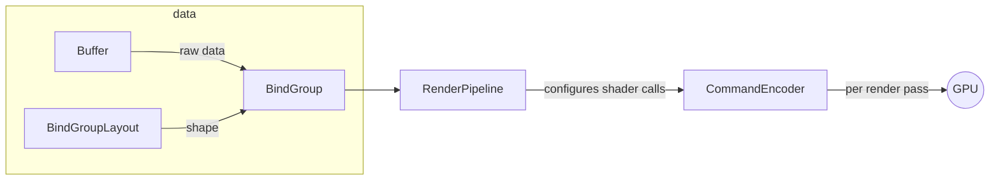

# <mark>\[WIP\]</mark> Technical Appendix

> WIP: need to do a pass for language and concision

JS13K forces you to get intimately familiar with every way to make code
small - there's no silver bullet, you have to attack size from every
direction. Here's a walkthrough of how DARKWHITE got to 13KB.

## Build Pipeline

Your build pipeline compacts what you've written and is half the battle; the
first thing I did was
[set one up](https://github.com/cutout-studios/js13k-2026/blob/main/scripts/bundle.ts).
Three components do the compacting:

- **Minification** - strips human-relevant information from the code: methods
  and data get renamed from what you called them (`myCoolFunction`) to the
  nearest-available, shortest identifier (`a`, `b`, `c`, and so on).
  - Because JavaScript compiles "just in time," minification has a nice side
    effect: less input to scan means slightly faster initial execution, too.
  - Minification is "intent preserving," so each language in your program
    needs its own minifier. I used
    [`Deno.bundle`](https://docs.deno.com/runtime/reference/cli/bundle/) for
    TypeScript,
    [`html-minifier-next`](https://github.com/j9t/html-minifier-next) for HTML
    and CSS,
    [`esbuild-minify-templates`](https://github.com/MaxMilton/esbuild-minify-templates)
    for raw text 🤷, and
    [`wgsl-plus`](https://github.com/JSideris/wgsl-plus) for the shader - it
    isn't complete, and
    [`wgslender`](https://github.com/HugoDaniel/wgslender) might have saved
    me some work.
  - Print your minified code every build - you'll spot things that could be
    smaller. Catching preserved object properties this way led to converting
    everything into tuples, functions, inlined values, and system aliases
    (I'd had property mangling at one point but dropped it) - a minimum
    500-byte win, the equivalent of 2-3 small features.
- [**Roadroller**](https://github.com/lifthrasiir/roadroller) - patron saint
  of JS13K. It does a random walk over the text you feed it and procedurally
  finds a bitpacking solution, injected into your app shell via your chosen
  method.
  - Prefer the "write" method over "eval" (s/o
    [@scmx](https://github.com/scmx) for the advice!!) - Roadroller hasn't
    been updated in years and chokes on modern JavaScript under "eval".
  - It's random, so run it multiple times and
    [keep the best result](https://github.com/cutout-studios/js13k-2026/blob/main/scripts/bundle.ts#L133-L156).
    The CLI can
    [do this automatically](https://github.com/lifthrasiir/roadroller#output-configuration)
    if you're just running shell commands.
- **Compression** - like Roadroller, finds patterns across the entire input,
  but folds them together at a <mark><b>binary</b></mark> level instead of a
  text one. It's "destructive" (a compressed payload needs to be
  "uncompressed" to run again) and deterministic.

Each step earns its keep:

| Minified? | Road Roller'd? | Compressed w/ ECT? | Size   | Timing* | Compaction |
| --------- | -------------- | ------------------ | ------ | ------- | ---------- |
| ✅        | ✅             | ✅                 | 13294  | <2m     | 87.1%      |
| ✅        | ❌             | ✅                 | 14655  | <100ms  | 85.8%      |
| ✅        | ✅             | ❌                 | 17572  | <2m     | 83%        |
| ❌        | ✅             | ✅                 | 20347  | >5m     | 80.3%      |
| ❌        | ❌             | ✅                 | 23528  | ~150ms  | 77.2%      |
| ❌        | ✅             | ❌                 | 26915  | >5m     | 73.9%      |
| ✅        | ❌             | ❌                 | 32826  | <50ms   | 68.2%      |
| ❌        | ❌             | ❌                 | 103136 | <50ms   | 0%         |

_*All tests run with `deno run bundle` once or twice on M5 Max Apple Silicon._

JS13K only allows the DEFLATE family of compression algorithms, but I
couldn't help but see how [Brotli](https://en.wikipedia.org/wiki/Brotli)
would have fared - the following are all compressed with Brotli instead:

| Minified? | Road Roller'd? | Size      | Timing* | Compaction |
| --------- | -------------- | --------- | ------- | ---------- |
| ✅        | ✅             | **13178** | <2m     | **87.2%**  |
| ✅        | ❌             | 13599     | <100ms  | 86.8%      |
| ❌        | ✅             | 20231     | >5m     | 80.4%      |
| ❌        | ❌             | 21225     | ~100ms  | 79.4%      |

A couple of interesting tradeoffs:

- Brotli without Roadroller is only 2% bigger than the submitted game, but
  _meaningfully_ faster to build (milliseconds vs. minutes)!
- Roadroller on _top_ of Brotli saves _even more_ bytes! Crying knowing I
  could have had another precious 134B to work with. If only!

Which points to a technical takeaway: Roadroller's "write" method decodes via
`document.write`, which makes it a non-starter for anything handling
user-provided content. But if you run it once at build time and ship the
cached result - like every JS13K entry already does - the unpacking cost is
paid once, by you, not per-request. I've genuinely never seen this used in
production outside JS13K, even though it seems like it'd be a real (if
narrow) win anywhere your app kernel is small enough that the unpacking
overhead is negligible. Suspicious. I'll be saving that one for later!

## Browser APIs

Use them. It's free real estate -
[only the ones that are allowed, though](#allowlist). Instead of building a
new shader for the "galaxy" effect, I just used an animated CSS gradient -
far more compact than the alternative.

### WebGPU

WebGPU isn't actually that bad! The API is "flat" - very configuration-heavy,
which is a good thing, ultimately. All that configuration does is let you
customize exactly how the data you're transferring to the GPU gets passed
into your shaders. `Buffer`s, `BindGroup`s and `BindGroupLayout`s structure
and load the raw data; your `RenderPipeline` configures how that data gets
split across shader calls; the `CommandEncoder` does the actual _rendering_,
on a per-render-pass basis (so you can switch between `RenderPipeline`
configurations as needed):


```mermaid
flowchart LR
  subgraph data
    Buffer -->|raw data| BindGroup
    BindGroupLayout -->|shape| BindGroup
  end
  BindGroup --> RenderPipeline
  RenderPipeline -->|configures shader calls| CommandEncoder
  CommandEncoder -->|per render pass| GPU((GPU))
```

Everything else WebGPU provides is basically just different options for how
to do that. Once I had this mental model, the API became a lot less
intimidating.

> WIP: Inline code examples

Here's what that looks like in practice. Every object in the game shares one
[pipeline layout](https://github.com/cutout-studios/js13k-2026/blob/main/libraries/3D/webgpu/setupDevice.ts)
with exactly two bind group layouts - one storage buffer for per-instance
coordinates, one for per-material color data - so there's really only a
handful of actual `GPURenderPipeline`s in the whole game,
[cached per material](https://github.com/cutout-studios/js13k-2026/blob/main/libraries/3D/webgpu/getRenderPipeline.ts)
the first time it's used and reused for the rest of the run. Every object
also shares the exact same vertex format - just an XYZ position, nothing
else per vertex - so geometry is
[uploaded once](https://github.com/cutout-studios/js13k-2026/blob/main/libraries/3D/webgpu/loadObject.ts)
into a GPU buffer and never touched again: no indices, no per-vertex color or
normal data.

That leaves instancing to do the real work. Objects that share the same
geometry and material get batched into a group, and every frame the
[camera](https://github.com/cutout-studios/js13k-2026/blob/main/libraries/3D/camera.ts)
walks that group,
[multiplies](https://github.com/cutout-studios/js13k-2026/blob/main/libraries/3D/coordinates.ts#L42-L59)
each object's coordinate frame into camera space by hand (a 4x4 matrix
multiply, bit-twiddled to stay tiny), and packs the results into one
reusable, fixed-size storage buffer. That buffer gets uploaded once, and the
whole group renders in a single instanced draw call - the vertex shader just
indexes into it with `@builtin(instance_index)` to pick each instance's
transform. Hundreds of bullets sharing a geometry and material cost exactly
one draw call, not hundreds.

Materials themselves stay tiny to make this worth it: a shader string, a
small palette of colors packed from plain `0xRRGGBBAA` hex integers, and an
optional entry point. There's really
[one shader](https://github.com/cutout-studios/js13k-2026/blob/main/libraries/3D/materials/paint.wgsl)
in the entire game - swapping the fragment entry point (`L` for lit, `F` for
flat) reuses the same compiled shader module, and the fragment shader picks a
color out of the palette per-instance, so one draw call can still show
multiple colors.

If you want to learn WebGPU, I started with
[webgpufundamentals.org](https://webgpufundamentals.org), but eventually
switched to picking apart
[the examples here](https://webgpu.github.io/webgpu-samples/) line by line -
a lot more helpful.

#### 3D Rotation Bestiary

The most intimidating part of 3D programming, and what held me back for
years, was rotations - and after all this, I still don't fully understand
them.

To get the player's ship to both roll and aim the way it currently does, I
had to maintain a separate "roll" parameter, and I'm not entirely sure why,
but...

My sense is it's the same deal that limits the most naïve rotation approach:
**Euler Angles**. Represent a rotation as three separate rotations around the
X, Y, and Z axes, and you can lose a degree of freedom entirely - but only at
a specific alignment, not gradually with every rotation. Rotating your model
around the X-axis also drags your Y and Z axes around together; if that
rotation lands at exactly 90°, Y and Z end up pointing the same direction,
and rotating around either one does the same thing. Right at that instant,
you've permanently lost a degree of freedom.

This is why **Quaternions** exist - they add an extra, "fake" fourth
degree-of-freedom buffer that ensures you never run out (it's not fake
exactly - technically you're using that fourth dimension to "fold around"
the lock). They're impossible to visualize; the best I can picture is a
shadow on the wall in Plato's cave of the cube being rotated, which isn't
even right.

Because of this, I've come to find the "axis-angle" representation the more
natural interface: define the XYZ components of the rotation axis (like the
earth's!), then the angle you're rotating around it. Each "Euler Angle" is
actually an axis-angle rotation, one around each of the X, Y and Z axes -
which means a single axis-angle rotation isn't at risk of lock like the three
cumulative Euler Angles are, though multiple axis-angle rotations, I believe,
still can be. This comes back to the player ship: one axis-angle rotation for
aiming, another for roll - but no more. Mostly safe.

Which brings me to the rotation representation I didn't get to explore: if
you can compose multiple Quaternions without risk of lock, is there a
similar representation that follows from Axis-Angle? Yes - **Rotors**.
[Rotors are sort of underrated in game development.](https://marctenbosch.com/quaternions/)
Like Axis-Angle, a Rotor represents the 2D cross-section you're rotating
within (the axis in Axis-Angle is simply normal to it) - but it stores that
"axis" as three shadows (a "bivector"), the shadows that cross-section would
make if a light shone on it from each of the X, Y, and Z directions. Because
they're represented this way, Rotors don't collapse - you combine them by
composing those shadows. No risk of rotating one axis into another, and
they're just as computationally cheap as Quaternions, and interpolate just
as fine. So why don't we use Rotors everywhere? Unclear. I think Quaternions
just got there first.

### Audio

The other major API this game leans on is
[WebAudio](https://developer.mozilla.org/en-US/docs/Web/API/Web_Audio_API) -
there's no room in the budget for sample files, so every sound is
synthesized procedurally from a handful of basic waveforms, rendered once
into an `AudioBuffer` and reused everywhere:

```ts
const renderCycle = (shape: (phase: number) => number, cycles = 32) => {
  const buffer = context.createBuffer(1, sampleRate * cycles, sampleRate);
  const data = buffer.getChannelData(0);

  doTimes(data.length, (i) => data[i] = shape((i / data.length * cycles) % 1));

  return buffer;
};

const SINE_BUFFER = renderCycle((phase) => sin(phase * PI * 2));
const SQUARE_BUFFER = renderCycle((phase) => phase < 0.5 ? 1 : -1);
```

_<a href="https://github.com/cutout-studios/js13k-2026/blob/main/libraries/audio/buffer.ts">(Actual implementation here.)</a>_

A `Sound` is just a schedule of knob movements - gain, pitch, pan - layered
on top of one or more of those buffers, played through a per-sound
[`DynamicsCompressorNode`](https://developer.mozilla.org/en-US/docs/Web/API/DynamicsCompressorNode)
into one shared master lowpass filter, which does double duty as a mix bus
and a cheap "everything's coming from the same small speaker" cohesion
trick.

_<a href="https://github.com/cutout-studios/js13k-2026/blob/main/libraries/audio/createSound.ts">(Actual implementation here.)</a>_

Positional audio is just as procedural: pan is derived directly from an
object's X coordinate on screen, rather than anything resembling a real
spatial audio graph.

## Utilities

Beyond the two big APIs, a handful of small shared utilities ended up doing
an outsized amount of the compaction work.

Proceduralization basically makes the JS13K world go around. My biggest wins
were procedural - the diversity of geometry I had exploded when I realized I
could generate everything as a [lathe](https://en.wikipedia.org/wiki/Lathe)
does:

```ts
const lathe = (loops, divisions) => {
  const result = [];

  for (const [radius, position] of loops) {
    for (let index = 0; index < divisions; index++) {
      result.push(
        getLatheTriangle(radius, divisions, index, position),
      );
    }
  }

  return result;
};
```

_<a href="https://github.com/cutout-studios/js13k-2026/blob/main/libraries/3D/geometry.ts">(Actual implementation here.)</a>_

Randomness is the most basic form of proceduralization. Weighted randomness -
averaging a few `random()` calls together to bias rolls toward the center of
a range instead of flat-uniform - and a simple "no immediate repeats" deck
both ended up
[getting used](https://github.com/cutout-studios/js13k-2026/blob/main/libraries/random.ts#L6-L8)
a
[surprising amount](https://github.com/cutout-studios/js13k-2026/blob/main/app/game/decks.ts#L26-L34).

Timing needed the same treatment. A tiny
[`startClock`](https://github.com/cutout-studios/js13k-2026/blob/main/libraries/clock/startClock.ts)
wraps `requestAnimationFrame` with delta-time clamping, and
[`createActionSequencer`](https://github.com/cutout-studios/js13k-2026/blob/main/libraries/clock/createActionSequencer.ts)
turns a list of `[action, duration]` pairs into a loop-able, declarative
behavior timeline - one small utility standing in for every enemy attack
pattern and weapon-firing rhythm in the game, instead of one-off timers
scattered everywhere.

This was also where "Dirty Abstractions" came in - a trick that came to me
during the competition: since compressors love repetition, what if I forced
abstractions I normally wouldn't reach for? A couple examples:

- In place of pretty much every loop I could, I wrote
  [`doTimes`](https://github.com/cutout-studios/js13k-2026/blob/main/libraries/common.ts#L30-L38).
  Felt gross. Saved me hundreds of bytes.
- Despite the player ship being objectively a different thing than the enemy
  ships, I forced both the player and the enemies to use the same ship code.
  It sucked. +100 bytes.
- This also didn't always work.
  [`flat`](https://github.com/cutout-studios/js13k-2026/blob/main/libraries/common.ts#L39-L63)
  ended up being net neutral, but migrating to it was so much work I just
  left it in, hoping it might amortize.

It's weird. As with everything in JS13K, I'd like to say you should only
reach for this technique if you're desperate. But... you _will_ be
desperate.
