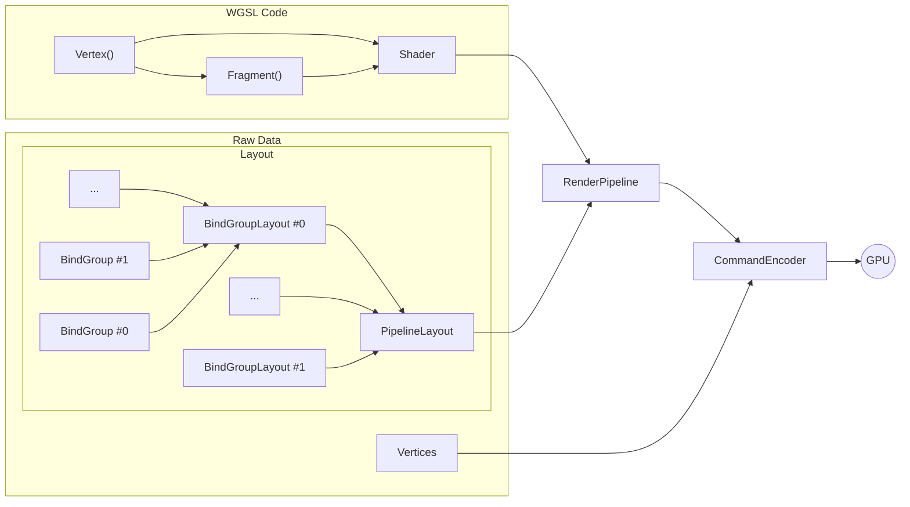

# DARKWHITE: Technical Walkthrough

<p align="center">
  <a href="./POSTMORTEM.md">Postmortem</a> |
  <b>Technical Walkthrough</b> |
  <a href="./PLAN.md">Post-JS13K Plan</a>
</p>

---

JS13K forces you to get intimately familiar with every possible way to make code
small - there's no silver bullet, you have to attack size from every angle.
Here's a walkthrough of how DARKWHITE got to 13KB.

> [!NOTE]
> Disclaimers:
>
> - I learned SO MUCH from this project that I simply cannot cram everything
>   into a reasonably-sized document. Feel free to read the source!
> - All code snippets have been simplified for readability, they won't run as
>   written.

## Build Pipeline

Your build pipeline compacts everything you've written and is half the battle.
The very first thing I did was
[set one up](https://github.com/cutout-studios/js13k-2026/blob/main/scripts/bundle.ts).
There were three stages to the compacting:

### Minification

Minification strips human-relevant information from the code: methods and data
get renamed from what you called them (`myCoolFunction`) to the
nearest-available, shortest identifier (`a`, `b`, `c`, and so on). Because
JavaScript compiles "just in time," minification can have side effect of
increasing your initial execution time slightly.

Minification is also "intent preserving," so the process needs to understand the
language you're compacting. I used
[`Deno.bundle`](https://docs.deno.com/runtime/reference/cli/bundle/) for
TypeScript, [`html-minifier-next`](https://github.com/j9t/html-minifier-next)
for HTML and CSS,
[`esbuild-minify-templates`](https://github.com/MaxMilton/esbuild-minify-templates)
for raw text, and [`wgsl-plus`](https://github.com/JSideris/wgsl-plus) for the
shader - but it isn't complete, and the later-discovered
[`wgslender`](https://github.com/HugoDaniel/wgslender) might have saved me some
work.

> **Tip:** Definitely read through your minified code - you'll spot things that
> could be made even smaller. I caught exploded code that I then converted to
> tuples, functions, inlined values, and system aliases - a roughly 500-byte
> savings, equivalent to a couple small features.

### [Roadroller](https://github.com/lifthrasiir/roadroller)

Patron saint of JS13K, Roadroller does a random walk over the text you feed it
and procedurally finds a bitpacking solution. It injects that result into an app
shell via your chosen method. **Tips:**

- Prefer the "write" method over "eval" (s/o [@scmx](https://github.com/scmx)
  for the advice!!) - Roadroller hasn't been updated in years and chokes on
  modern JavaScript under "eval".
- It's random, so run it multiple times and
  [keep the best result](https://github.com/cutout-studios/js13k-2026/blob/main/scripts/bundle.ts#L133-L156).
  The CLI can
  [do this automatically](https://github.com/lifthrasiir/roadroller#output-configuration).

### Compression

Like Roadroller, Compression algorithms find patterns across the entire input,
but unlike Roadroller, they fold them together at a _binary_ level. Therefore
the result needs to be _uncompressed_ before it can run again, so the savings
are only felt during file transfer.

### Putting it Together

I thought it was maybe a bit much, but turns out each of these three stages is
necessary:

| Minified? | Road Roller'd? | Compressed w/ ECT? | Size                      | Timing* | Compaction                |
| --------- | -------------- | ------------------ | ------------------------- | ------- | ------------------------- |
| ✅        | ✅             | ✅                 | <mark><b>13294</mark></b> | <2m     | <mark><b>87.1%</mark></b> |
| ✅        | ❌             | ✅                 | 14655                     | <100ms  | 85.8%                     |
| ✅        | ✅             | ❌                 | 17572                     | <2m     | 83%                       |
| ❌        | ✅             | ✅                 | 20347                     | >5m     | 80.3%                     |
| ❌        | ❌             | ✅                 | 23528                     | ~150ms  | 77.2%                     |
| ❌        | ✅             | ❌                 | 26915                     | >5m     | 73.9%                     |
| ✅        | ❌             | ❌                 | 32826                     | <50ms   | 68.2%                     |
| ❌        | ❌             | ❌                 | 103136                    | <50ms   | 0%                        |

_*All tests were run with `deno run bundle` once or twice on M5 Max Apple
Silicon, these are not scientific results._

JS13K requires you use the DEFLATE family of compression algorithms, but I
couldn't help but see how [Brotli](https://en.wikipedia.org/wiki/Brotli)
compared:

| Minified? | Road Roller'd? | Size                      | Timing* | Compaction                |
| --------- | -------------- | ------------------------- | ------- | ------------------------- |
| ✅        | ✅             | <mark><b>13178</b></mark> | <2m     | <mark><b>87.2%</b></mark> |
| ✅        | ❌             | 13599                     | <100ms  | 86.8%                     |
| ❌        | ✅             | 20231                     | >5m     | 80.4%                     |
| ❌        | ❌             | 21225                     | ~100ms  | 79.4%                     |

Some tradeoffs:

- Brotli without Roadroller is 2% bigger than the submitted game, but was
  _meaningfully_ faster to build (milliseconds vs. minutes)!
- Roadroller on _top_ of Brotli saves _even more_ bytes! Crying that I coulda
  had another precious 134B to work with. If only!

**Roadroller in production?** Roadroller's "write" method decodes via
`document.write`: a non-starter for user-provided content. But if run against
your core logic I don't see why you couldn't ship the cached result. Seems like
a potential win if the unpacking overhead is small enough!

## Browser APIs

I believe the core of of keeping your entry small is leaning on Browser APIs
wherever possible. There were two prominent in my entry: `WebAudio` _(very
common)_ and `WebGPU` _(brand new this year!)_.

### `WebGPU`

WebGPU has been around for a minute but 2026 was the first year it could be used
in JS13K: it's finally on by default in Chrome and Firefox! WebGPU _seems_
intimidating at first, but after some time with it I didn't find it too bad.

The API is very... how do you say... "flat": configuration-heavy. Declarative.
Generally speaking, all that this configuration does is let you customize how
your data ends up in your shader code.

Specifically, `Layout`s organize the data sent; your `Pipeline` configures how
that data appears in your shader calls; and the `CommandEncoder` executes the
actual rendering process.



Everything WebGPU provides is basically just different options for how to do all
that. Once I found this mental model, the API became a lot less scary.

### Managing GPU Data: `Vertex` vs. `PipelineLayout`

Loading your application-specific data into the GPU requires transforming it
into Typed Arrays and then writing those arrays into an honest-to-god on-the-GPU
memory block (a "buffer"):

```ts
const vertexData = new Float32Array(flat(vertices));
const vertexGPULocation = gpu.createBuffer({
  usage: GPUBufferUsage.VERTEX, // i.e. the "type" of data buffer
  size: rawVertexData.byteLength,
});

gpu.queue.writeBuffer(vertexGPULocation, offset, vertexData);
```

> [!IMPORTANT]
> There is no garbage collection in WebGPU! You need to free your GPU's working
> memory manually:
>
> ```ts
> for (const object of staleObjects) {
>   object.dataLocation.destroy();
> }
> ```

Different types of buffers do different things (!): for your core vertex data
you use a `"vertex"` buffer. This buffer has a pre-determined structure, mapping
out the XYZ coordinates of each vertex directly into the vertex shader code.

For the data in your `PipelineLayout`, buffer types are case-by-case and
application-specific. For DARKWHITE, I created two groups, one for spatial data
_(the local coordinates of each object)_ and one for appearance data _(the
colors of the faces of each object)_:

```ts
const localCoordinateBinding = {
  binding: 0, // binds to @binding(0)
};

const spaceGroupLayout = device.createBindGroupLayout({
  entries: [localCoordinateBinding],
});

const pipelineLayout = device.createPipelineLayout({
  bindGroupLayouts: [
    spaceGroupLayout, // binds to @group(0)
    appearanceGroupLayout, // binds to @group(1)
  ],
});
```

I could have smashed everything into a single, global data group, but it felt
more natural to separate things by concern, like folders in a file system.

Later utilities were authored to write the currently needed data over the
assigned GPU locations in the layout:

```ts
const loadLocalCoordinates = (newLocalCoordinates: Float32Array[]) => {
  device.queue.writeBuffer(
    localCoordinatesLocation,
    0,
    flat(newLocalCoordinates),
  );
};
```

### WGSL Shader Code: `RenderPipeline`

With the data wrangled it was time to write the shaders needed to process said
data. Shaders are a whole world I had zero experience with before, so I kept my
work here very simple. Here are the fundamentals I learned.

In the shader code you first need to "import" the data you've transferred &
bound via layouts to be able to actually use it:

```wgsl
// we're referencing the data group 0 (defined as the spatial group in my layout)
// at binding 0 (where I put all the local coordinate data)
@group(0) @binding(0)
// var<storage, read> - needs to match the buffer type you specified in the JS
var<storage, read> local_coordinates: array<mat4x4f>;

@group(1) @binding(0)
var<storage, read> color_palette: array<vec4f>;
```

Your `@vertex` and `@fragment` functions access further data via various
annotations. The `@vertex` shader is responsible for returning the global
positions of each polygon's vertices to the `@fragment` shader, which colors
them. I like to think of `@vertex` as the "HTML" of your shader, with
`@fragment` as the CSS.

In this `@vertex` shader, I'm using the `@location(0)` annotation to load the
vertex position, and a `@builtin` to load the ID of the 3D object this current
vertex belongs to. _(`@builtin`s are how you access standard metadata within the
WGSL system.)_. `local_coordinates` is already available to us because we
imported it above.

```wgsl
@vertex
fn main(
  @location(0) vertex: vec3f,

  @builtin(instance_index) object_id: u32
) -> @builtin(position) vec4f {

  // transform vertex to global coordinate system
  return local_coordinates[object_id] * vec4f(vertex, 1.0);
}
```

`@fragment` calls are a bit sneakier - they're actually called for each _pixel_
on the screen, not each vertex. However, the `position` builtin is the nearest
location visible _from_ that pixel _within_ the geometry that your `@vertex`
calls define! It is _not_ the pixel's position!

You'll notice I'm also using a `@builtin` to access the ID of the face of the
geometry the current pixel is looking at. This allows us to pull that face's
"base" color from the palette we loaded.

```wgsl
@fragment
fn paint(
  // builtins
  @builtin(position) position: vec4f,
  @builtin(primitive_index) face_id: u32
) -> @location(0) vec4f {
  // pull face color from ring palette
  let face_color = color_palette[face_id % arrayLength(&color_palette)];

  return vec4f(shade_color(position) * face_color.rgb, face_color.a);
}
```

There's so much to this space. [Book of Shaders](https://thebookofshaders.com/)
doesn't come in WGSL, so I'll have to find other resources to dive even deeper.

### The Actual Rendering Process: `CommandEncoder`

With everything configured and loaded into the GPU, doing the actual rendering
was fairly straightforward. I simply had to define my rendering job, iterate
over everything I wanted to draw, and queue that job in the GPU for completion:

```ts
// start a rendering job for the frame
const job = gpu.createCommandEncoder();
const step = job.beginRenderPass(canvasSettings);

// each object group shares spatial and appearance data
for (const objectGroup of objectGroups) {
  // point to data already loaded in the GPU
  step.setVertexBuffer(slotID, objectGroup.vertexDataLocation);

  step.setPipeline(objectGroup.pipeline);
  setPipelineData(step, objectGroup);

  // execute shader code - drawing all objects in one go
  step.draw(objectGroup.vertexData.length, objectGroup.length);
}

step.end();
gpu.queue.submit([job.finish()]);
```

_<a href="https://github.com/cutout-studios/js13k-2026/blob/main/libraries/3D/webgpu/createRenderTarget.ts">(Actual
implementation here.)</a>_

Do this every `requestAnimationFrame` and bam, you have a highly-performant 3D
rendering engine!

#### Aside: 3D Rotation

The most intimidating part of 3D programming for me was always rotations. This
project helped me understand them further, but not completely.

The most naïve approach to 3D rotation is **Euler Angles**. You represent one
rotation as three sub-rotations around the X, Y, and Z directions. The problem
with this is that each rotation risks losing a degree of freedom and incurring
**Gimbal Lock**. Rotating your model around the X-axis drags your Y axis into
your Z, slowly coupling them.

This is why **Quaternions** exist - best I can describe it, this approach to
rotation adds a sort of "fake" fourth dimensional, degree-of-freedom buffer
that's used to "fold around" the lock. They're impossible to visualize: I
picture a shadow of a rotating cube on the wall of Plato's cave, which isn't
even right.

And so, I found Axis-Angle to be the most natural interface. In Axis-Angle you
simply specify the axis you want to rotate around and the amount of rotation.
"Euler Angles" are essentially three Axis-Angle rotations in XYZ sequence.

Which begs the question - are multiple Axis-Angle rotations still at risk for
lock? Yes! To get the player's ship to both roll and aim the way it currently
does, I have a separate "roll" rotation... but with only two rotations applied
roughly orthogonal to each other, it's mostly safe. Mostly.

There was one rotation method I didn't get to explore: **Rotors**. They're like
the Quaternion analogue to Axis-Angle and are
[sort of underrated in game development.](https://marctenbosch.com/quaternions/)
Like Axis-Angle, the Rotor contains the orientation you're rotating within - but
it stores that "axis" as a plane, and that plane as three shadows (a
"bivector"). These are the shadows your plane of rotation would make if you
shone a light on it from each of the XYZ directions.

Rotors can't lock - you simply combine their shadows. No risk of rotating one
axis into another, with all the same advantages of Quaternions. So if we can
_actually_ visualize them, why don't we use Rotors everywhere? Unclear. I think
Quaternions just got there first (not unlike the QWERTY keyboard layout).

### `WebAudio`

The other major API DARKWHITE leans on is
[WebAudio](https://developer.mozilla.org/en-US/docs/Web/API/Web_Audio_API).

Some form of audio generation is almost necessary for JS13K. There's no room in
the budget for sample files, so every sound must be proceduralized.

I chose to generate a series of fundamental waves like so:

```ts
const renderCycle = (shape: (phase: number) => number, cycles = 32) => {
  const buffer = context.createBuffer(1, sampleRate * cycles, sampleRate);
  const data = buffer.getChannelData(0);

  doTimes(data.length, (i) => data[i] = shape((i / data.length * cycles) % 1));

  return buffer;
};

const SAWTOOTH_BUFFER = renderCycle((p) =>
  (p * 2 - 1) * Math.min(1, (1 - p) * 20, p * 20)
);
```

_<a href="https://github.com/cutout-studios/js13k-2026/blob/main/libraries/audio/buffer.ts">(Actual
implementation here.)</a>_

I chose this method over using `WebAudio`'s
[oscillator knobs](https://developer.mozilla.org/en-US/docs/Web/API/OscillatorNode)
because it allowed me to generate more complex fundamentals (like the sawtooth
wave above) while maintaining the implementation consistency the compression
algorithm loves.

I then assembled the final sounds by gluing multiple audio
[loop layers](#timing) together via compressor and lowpass filters. All told, my
final sound definitions were basically just data:

```ts
const defaultWeaponSound = createSound(
  // Noise layer: the muzzle flare.
  [NOISE_BUFFER, [
    [
      [
        1, // knob turned (playback rate)
        [0.7, 1], // knob value (randomly chosen between 0.7 - 1)
      ],
      0, // breakpoint timing (0s)
    ],
    [[0, 0], 0.01], // knob 0 is volume
    [[0, [0.01, 0.02]], 0.003],
    [[0, 0.01], 0.003],
    [[0, 0], 0.06], // layer goes silent by 0.06s
  ]],
  // Low-end to make the sound punchy
  [SINE_BUFFER, [
    [[1, [0.2, 0.6]], 0],
    [[0, 0.02], 0.006],
    [[1, [0.1, 0.16], true], 0.03],
    [[0, 0], 0.1], // layer goes silent later - 0.1s
  ]],
  // A subtler "laser pistol" sound within.
  [BUZZ_BUFFER, [
    [[1, [4.3, 6]], 0],
    [[0, 0.01], 0.03],
    [[0, 0], 0.14],
    [[1, [0.2, 0.5]], 0], // pitch sweep
  ]],
);
```

## Utilities & Proceduralization

Beyond the Browser APIs, I needed a few utilities to bring everything together:

### Timing

Games have a huge emphasis on timing that standard web applications do not have.
At [the heart of DARKWHITE](../app/module.ts) is a ticking clock:

```ts
startClock((tickLength) => {
  // ...

  updateHUD(gameState, tickLength);
  updateGame(gameState, tickLength);

  // ...
});
```

The time values provided by this central clock feed into every animation and
action sequence throughout the game. For instance, the firing patterns of
different weapons:

```ts
const burstFireLoop = createActionLoop([
  [doNothing, 0.85], // seconds
  [fireAction],
  [doNothing, 0.15],
  [fireAction],
]);

// later, to advance the loop:
burstFireLoop(tickLength);
```

### Randomness

Randomness is a basic form of procedualization and is the easiest way to add
variety to your game.

Naïvely calling `Math.random()` can be a problem if you want the results to
cluster around a certain value. Averaging multiple calls converges on a bell
curve:

```ts
const bell = () => (random() + random() + random()) / 3;
```

Loot-dropping mechanics have you picking from a range of values quite often, and
so the following function that does just that got used a surprising amount:

```ts
const range = (lo, hi) => lo + (hi - lo) * bell();
```

Another problem with unadulterated randomness is that the same value can be
picked multiple times in sequence, making something that is truly random _feel_
non-random. This was solved with a simple `deck` primitive:

```ts
export const draw = (deck, n = 2) => {
  const value = deck.pop();

  // puts the card back in within the last n spots
  deck.splice(round(range(0, n)), 0, value);

  return value;
};
```

I've since learned this is referred to the "bag of marbles" approach
in-industry.

### "Dirty Abstractions"

During the competition I had a thought: if compressors love repetition, what if
I forced abstractions I normally wouldn't reach for?

This lead to `doTimes`:

```ts
const doTimes = <T, K>(
  enumerator: number | Array<K>,
  action: (element: K, index: number) => T,
): T[] =>
  (typeof enumerator == "number"
    ? arrayFrom(Array(max(0, round(enumerator))).keys())
    : enumerator)
    .map(action as (element: K | number, index: number) => T);
```

I used this in place of pretty much every loop I could. Felt gross. Saved me
hundreds of bytes.

_(This didn't always work.
[`flat`](https://github.com/cutout-studios/js13k-2026/blob/main/libraries/common.ts#L39-L63)
ended up being net neutral, but migrating to it was so much work I just left it
in, hoping it might amortize.)_

Despite the player ship being objectively a different thing than the enemy
ships, I forced both the player and the enemies to
[use the same ship code](../app/game/ship/module.ts). It sucks. +100 bytes.

I'd like to say you should only reach for this technique if you're desperate.
But... it's 13kB. You _will_ be desperate.

### Higher-order Proceduralization

Let's end with a pallette cleanser. My biggest win was unsurprisingly
procedural.

The diversity of geometry I could include exploded once I realized I could
generate everything as a [lathe](https://en.wikipedia.org/wiki/Lathe) does:

```ts
const lathe = (loops, divisions) => {
  const result = [];

  for (const [radius, position] of loops) {
    for (let index = 0; index < divisions; index++) {
      result.push(
        getLatheTriangle(radius, divisions, index, position),
      );
    }
  }

  return result;
};
```

_<a href="https://github.com/cutout-studios/js13k-2026/blob/main/libraries/3D/geometry.ts">(Actual
implementation here.)</a>_

I was even able to write a simple
[CSG](https://en.wikipedia.org/wiki/Constructive_solid_geometry) on top of this:

```ts
// green ship
flattenObjects(
  // hull
  createObject([], createSphere(0.20, 24)),
  // right prong
  createObject(
    [
      // xyz position
      [0.2, -0.08, 0.15],

      // axis-angle rotation
      [[0, 1, -1], 1.25],
    ],
    createPyramid([0.065, 0.065, 0.095], 12),
  ),
  // left prong
  createObject(
    [[-0.2, -0.08, 0.15], [[0, 1, -1], -1.25]],
    createPyramid([0.065, 0.065, 0.095], 12),
  ),
);
```

Paired with the
[face-painting approach we glossed over in the WebGPU section](#wgsl-shader-code-renderpipeline)
, the stuff that typically dwarfs your JS13K entry (the visual content) ended up
a fraction of the final result here. Of course, this art style has been
described as "angry shapes", which is very fair.

---

<p align="center">
  <a href="./POSTMORTEM.md">Postmortem</a> |
  <b>Technical Walkthrough</b> |
  <a href="./PLAN.md">Post-JS13K Plan</a>
</p>
